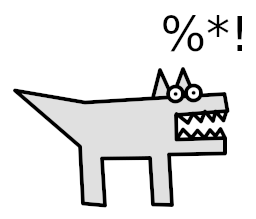
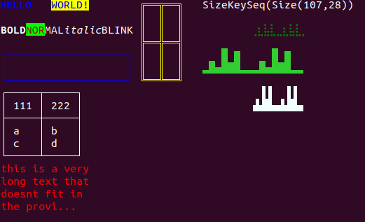

# swearwolf



> A low level Scala library for creating text user interfaces.


The library allows to create full-screen text-based applications (TUI). It sends the correct control characters to the terminal to display text in the given style.

The additional library of UI-primitives, *swearwolf-woods* can be used to display basic elements on the screen:
a *box*, *graph*, *grid*, *label*, *table* and *rich-text*.

<br clear="right" /><!-- Turn off the wrapping for the logo image. -->

## Preview



## Usage

Add the following dependency to your `build.sbt`:

```scala
libraryDependencies += "com.github.gchudnov" %% "swearwolf-core" % "1.0.2"

// Optionally, include the UI-primitives library:
libraryDependencies += "com.github.gchudnov" %% "swearwolf-woods" % "1.0.2"
```

In the application, import:

```scala
import com.github.gchudnov.swearwolf._
import com.github.gchudnov.swearwolf.util._

// If UI-primitives library is included, add:
import com.github.gchudnov.swearwolf.woods._
```

Next, create an *instance of the screen* by calling `Screen.acquire()` or `Screen.acquireOrThrow()` methods.

Use methods `screen.put(/* ... */)` to print text on the screen and invoke `screen.flush()` to flush data to the terminal.
At the end, call `screen.close()` to close the screen.

To listen for control- (e.g. screen size change), keyboard- and mouse- events, set an *event handler* and start an *event loop*.
Event Haldner and Event Loop are optional and might be needed only for interactive applications.

An example:

```scala
Using.resource(Screen.acquireOrThrow()) { (sc: Screen) =>
  val handler = /* (ks: List[KeySeq]) => Either[Throwable, EventLoop.Action] */
  for {
    _ <- sc.put("Hello World!")
    _ <- sc.eventLoop(EventLoop.withDefaultHandler(handler))
  } yield ()
}
```

## API

### Acquire / Release the Screen

A `Screen` is a [Releasable](https://www.scala-lang.org/api/current/scala/util/Using$$Releasable.html) resource that is used to interact with the terminal.

- **Screen.acquire(): Either[Throwable, Screen]**

  Constructs an instance of the screen.

- **Screen.acquireOrThrow(): Screen**

  Constructs an instance of the Screen; Throws an Rxception if there is an error occured.


### Screen interface

Screen interface contains a list of methods to display text on the terminal and control it.

- **def size: Size**

  Returns the current size of the screen *(width, height)*.

  NOTE: the size of the screen is updated only if either `eventLoop` or `eventPoll` are called (see the description of these methods below).

- **def put(pt: Point, value: String): Either[Throwable, Unit]**

  Displays the given text at the specified position of the screen. NOTE: Point(0, 0) represents the top-left corner of the screen.

- **def put(pt: Point, value: String, style: TextStyle): Either[Throwable, Unit]**

  Displays the given text at the specified position of the screen with the given [text style](#Text-Styles).

- **def put(pt: Point, value: Array[Byte]): Either[Throwable, Unit]**

  Displays the given array of bytes at the specified position of the screen.

- **def cursorHide(): Either[Throwable, Unit]**

  Hides the cursor on the screen.

- **def cursorShow(): Either[Throwable, Unit]**

  Displays the cursor on the screen.

- **def mouseTrack(): Either[Throwable, Unit]**

  Enables mouse coordinates tracking. Coordinates are reported when a mouse button is clicked.

- **def mouseUntrack(): Either[Throwable, Unit]**

  Disables mouse tracking.

- **def bufferNormal(): Either[Throwable, Unit]**

  Chnages terminal buffer to normal.

- **def bufferAlt(): Either[Throwable, Unit]**

  Changes terminal buffer to the alternative one.

- **def clear(): Either[Throwable, Unit]**

  Clears the screen.

- **def flush(): Either[Throwable, Unit]**

  Flushes buffered draw operations to the terminal. After invoking `put()`, `clear()`, `mouseTrack()` / `mouseUntrack()`, etc. calls a flush is needed. Otherwise some of the operations might be still buffered in the application and not reflected on the screen.

- **def init(): Either[Throwable, Unit]**

  Initializes the screen. This method is called *automatically* when the screen is acquired using `Screen.acquire` or `Screen.acquireOrThrow` operations. When called, it runs `clear()`, `cursorHide()`, `mouseTrack()` and other internal function to initialize the screen.

- **def shutdown(): Either[Throwable, Unit]**

  Reverts all operations that were executed in `init()`. The method is called automatically when `close()` method is invoked.

- **def eventLoop(handler: KeySeqHandler): Either[Throwable, Unit]**

  Starts the event loop with the given [key sequence handler](#Key-Sequence-Handler).
  Event loop is responsible for handling keyboard-, mouse-, screen-size- events using the provided event handler. If the default handler is provided to the event loop (`EventLoop.defaultHandler`) the event loop exists only when `ESC` button is pressed.

- **def eventLoop(): Either[Throwable, Unit]**

  Starts the event loop with the default event handler: `EventLoop.defaultHandler`. It handles screen resize events and waits for the `ESC` button to be pressed to exit the event loop.

- **def eventPoll(): Either[Throwable, List[KeySeq]]**

  Polls for new events and returns them as a list of [Key Sequence Events](#Key-Sequence-Events)

- **def close(): Unit**

  Closes the screen. The default implementation calls the `shutdown()` method and throws an error if `shutdown` fails.


### Key Sequence Events

Key Seqnence trait, `KeqSeq` represents a control event received from the terminal.
The following Key Sequences are propagated to the event handler:

- **case class SizeKeySeq(sz: Size) extends KeySeq**

  Raised when the terminal window was resized. `Size` contains the new *width* and *height* of the screen.

- **case class CharKeySeq(ch: Char, mods: Set[KeyModifier]) extends KeySeq**

  Represents a text character with a set of key modifers.
  `KeyModifier` is a control key: `Shift`, `Alt` or `Ctrl`.

- **case class CtrlKeySeq(key: KeyCode, mods: Set[KeyModifier]) extends KeySeq**

  Represents a control ket code, e.g. `F1` with a set of key modifiers.
  `KeyModifier` is a control key: `Shift`, `Alt` or `Ctrl`.

- **case class MouseKeySeq(pt: Point, button: MouseButton, action: MouseAction, mods: Set[KeyModifier]) extends KeySeq**

  Represents a captured mouse event when a mouse button was pressed or released.
  `MouseButton` is one of the following events: `Left`, `Middle`, `Right`, `ScrollBackward` or `ScrollForward`.
  `MouseAction` is either a `Press` or `Release` event.

- **case class UnknownKeySeq(bytes: Seq[Byte]) extends KeySeq**

  Represents an unknown input that the library failed to parse.
  When the library reports this key sequence, most likely one of the parsers is incomplete on the given OS / terminal and cannot parse byte sequence that was sent to the library.


### Key Sequence Handler

Key Sequence Handler, `KeySeqHandler` has the following signature:

```scala
type KeySeqHandler = List[KeySeq] => Either[Throwable, EventLoop.Action]
```

it is used in the `eventLoop` to process the incoming key sequences, `KeySeq` and trigger some actions.
For example, when a keyboard key is pressed, a key sequence is generated that is passed to the `KeySeqHandler` in the event loop.

After processing the event handler should return one of two `EventLoop.Action`s:

- `Action.Continue` if we want to continue running the event loop,
- `Action.Exit` to exit the event loop.

The default event handler, `EventLoop.defaultHandler` returns `Action.Exit` only when `ESC` key is pressed.

To compose a user-provided event handler with the default one, `EventLoop.withDefaultHandler(handler: KeySeqHandler): KeySeqHandler` can be used.
This method always invokes both handlers (one provided by the user and the default one) and returns `Action.Exit` if any of the handlers returned `Action.Exit`.


### Text Styles

`TextStyle` is a combination of the following styles:

- **TextStyle.Empty**

  No style is specified. The default text foreground and background colors are used.

- **TextStyle.Foreground(color: Color)**

  Specifies a foreground [color](#Colors) of the text.

- **TextStyle.Background(color: Color)**

  Specifies a background [color](#Colors) of the text.

- **TextStyle.Bold**

  Makes letters of a text thicker than the surrounding text.

- **TextStyle.Italic**

  Text is written in a script style.

- **TextStyle.Underline**

  Draws lines under letters for emphasis.

- **TextStyle.Blink**

  Text is blinking on the screen.

- **TextStyle.Invert**

  Foreground and background colors of the text are inverted.

- **TextStyle.Strikethrough**

  Draws a line throush the given text.

Text Styles can be composed using '|' operator, e.g.:

```scala
val textStyle = TextStyle.Foreground(NamedColor.Azure) | TextStyle.Background(NamedColor.LightGray) | TextStyle.Strikethrough
```

### Colors

A `Color` is a combination of **R**, **G** and **B** values in range `[0 - 255]` and represented as: `Color(r: Int, g: Int, b: Int)`.
Colors can be constructed by calling `Color.parse` or by specifying the exact values of R, G and B.

- **Color.parse(value: String): Either[Throwable, Color]**

  Parses a color specified in `#RRGGBB` or `RRGGBB` format where `RR`, `GG`, `BB` are hex values.
  For example: `#FF0000` and `FF0000` are valid inputs representing red color.

In addition, the library defines [a set of predefined named colors](res/colors/NAMED-COLORS.md), `NamedColor`.
Named colors can be used directly, e.g. `NamedColor.Aqua` or `NamedColor.LightCyan` or parsed from a string by calling `NamedColor.parse`.

- **NamedColor.parse(name: String): Either[Throwable, Color]**

  `name: String` is the name of the color separated by '-' for composite words, e.g.: `aqua` or `light-cyan`.


## Swearwolf-Woods - UI Primitives Library

`Swearwolf-Woods` library provides basic building blocks (primitives) to rendering on the screen.

The available primitives include: a *box*, *graph*, *grid*, *label*, *table* and *rich-text*.

In the current implementation of the library these primitives are very basic and cannot be composed. In this way it is not possible to create a table where a cell includes a label or a box.

To use the library in the application, import:

```scala
import com.github.gchudnov.swearwolf.woods._
```

### Primitives Description

#### Box

Extends the `Screen` with a draw operation to display a box:

```scala
def put(pt: Point, box: Box, textStyle: TextStyle): Either[Throwable, Unit]
```

When a *Box* is constructed, `BoxStyle` can be used to specify a border to use: `Empty`, `SingleBorder`, `DoubleBorder`, `BoldBorder`.

#### Graph

Extends the `Screen` with a draw operation to display a graph:

```scala
def put(pt: Point, graph: Graph, textStyle: TextStyle): Either[Throwable, Unit]
```

When a *Graph* is constructed, `GraphStyle` can be used to specify the type of the graph to use: `Dot`, `Step`, `Quad`.
This value encodes how many points one character of the graph can contain.

- **Dot** - one text character contains 2-x and 4-y points.
- **Step** - one text character contains 1-x and 8-y points.
- **Quad** - one text character contains 2-x and 2-y points.

#### Grid

Extends the `Screen` with a draw operation to display a grid:

```scala
def put(pt: Point, grid: Grid, textStyle: TextStyle): Either[Throwable, Unit]
```

`Grid` is constructed by providing a cell-size and `GridStyle` to specify borders to use.

#### Label

Extends the `Screen` with a draw operation to display a label:

```scala
def put(pt: Point, label: Label, textStyle: TextStyle): Either[Throwable, Unit]
```

Label provides the `AlignStyle` that can be used to specify the way the text is aligned inside of the label.

#### Table

Extends the `Screen` with a draw operation to display a table:

```scala
def put(pt: Point, table: Table, textStyle: TextStyle): Either[Throwable, Unit]
```

A table takes `Seq[Seq[Any]` where each cell is converted to a string and displayed. `TableStyle` can be used to style borders of a table.

#### RichText

Extends the `Screen` with a draw operation to display a rich text:

```scala
def put(pt: Point, value: RichText): Either[Throwable, Unit]
```

`RichText` can be constructed using a html-like tags and their combinations:

- **bold**, **b**

  ```html
  <bold>TEXT</bold>
  <b>TEXT</b>
  ```

- **italic**, **i**

  ```html
  <italic>TEXT</italic>
  <i>TEXT</i>
  ```

- **underline**, **u**

  ```html
  <underline>TEXT</underline>
  <u>TEXT</u>
  ```

- **blink**, **k**

  ```html
  <blink>TEXT</blink>
  <k>TEXT</k>
  ```

- **invert**, **v**

  ```html
  <invert>TEXT</invert>
  <v>TEXT</v>
  ```

- **strikethrough**, **t**

  ```html
  <strikethrough>TEXT</strikethrough>
  <t>TEXT</t>
  ```

- **color**
  specifies a color using the following attributes:
  - **fgcolor**, **fg** to specify the foreground color of the text.
  - **bgcolor**, **bg** to specify the background color of the text.
  
  ```html
  <color fg='#FF0000' >TEXT</color>
  <color fgcolor='#FF0000' >TEXT</color>

  <color bg='#00FF00' >TEXT</color>
  <color bgcolor='#00FF00' >TEXT</color>

  <color fg='#FF0000' bg='#00FF00' >TEXT</color>
  <color fgcolor='#FF0000' bgcolor='#00FF00' >TEXT</color>
  ```

A more complex example:

```html
<b>BOLD</b><color fg='#AA0000' bg='#00FF00'>NOR</color>MAL<i>italic</i><k>BLINK</k>
```

Text and tags can be nested, for example:

```html
<i>A<b>text</b>B<u>C</u></i>
```


## Examples

The project contains two demo applications that demonstrate how to use the library with keyboard and mouse input.
To build, invoke:

```sbt
sbt examplePlain/assembly
sbt exampleZio/assembly
```

Executable files will be built and saved in the `/target` directory:

```bash
./target/example-plain
./target/example-zio
```

## Compatibility

**The library was built and tested on Ubuntu 18.04.5 LTS with GNU bash, version 4.4.20**.


## Contact

[Grigorii Chudnov] (mailto:g.chudnov@gmail.com)


## License

Distributed under the [The MIT License (MIT)](LICENSE).
