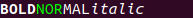

# swearwolf / rich

> Print rich text in the terminal

Allows using tags to specify styles text should be rendered with.

## Usage

```scala
import com.github.gchudnov.swearwolf.term.terms.IdSyncTerm
import com.github.gchudnov.swearwolf.term.writers.IdWriter
import com.github.gchudnov.swearwolf.rich.RichText
import com.github.gchudnov.swearwolf.rich.instances.IdRichText.*

val rich = RichText("<b>BOLD</b><fg='#AA0000'><bg='#00FF00'>NOR</bg></fg>MAL<i>italic</i><k>BLINK</k>\n")

val term   = IdSyncTerm.make()
val writer = IdWriter.make(term)

writer.putRich(rich)
writer.flush()
```

When rendered, produces the following output:



## Available Tags

`RichText` can be constructed using the following html-like tags:

- **bold**, **b**

  ```html
  <bold>TEXT</bold>
  <b>TEXT</b>
  ```

- **italic**, **i**

  ```html
  <italic>TEXT</italic>
  <i>TEXT</i>
  ```

- **underline**, **u**

  ```html
  <underline>TEXT</underline>
  <u>TEXT</u>
  ```

- **blink**, **k**

  ```html
  <blink>TEXT</blink>
  <k>TEXT</k>
  ```

- **invert**, **v**

  ```html
  <invert>TEXT</invert>
  <v>TEXT</v>
  ```

- **strikethrough**, **t**

  ```html
  <strikethrough>TEXT</strikethrough>
  <t>TEXT</t>
  ```

- **fg**, **fgcolor**, **color**

  ```html
  <fg='#FF0000'>TEXT</fg>
  <fgcolor='#FF0000'>TEXT</fgcolor>
  <color='#FF0000'>TEXT</color>
  ```

- **bg**, **bgcolor**, **background**

  ```html
  <bg='#00FF00'>TEXT</bg>
  <bgcolor='#00FF00'>TEXT</bgcolor>
  <background='#00FF00'>TEXT</background>
  ```

Quotes could be either singular (`'`) or double (`"`).

## Examples

- [examples/noninteractive](../examples/noninteractive) - writes RichText to stdout without capturing IO.
- [examples/either](../examples/either) - writes RichText to the terminal in interactive mode, using `Either[Throwable, *]` to wrap the result.
- [examples/zio](../examples/ziox) - integration with ZIO.
