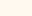

# COLORS

Predefined colors, supported by the library:

| Color | Name | Code | Code | Hex |
| --- | --- | --- | --- | --- |
|  | alice-blue | Color.AliceBlue | Color(240,248,255) | #F0F8FF |
|  | antique-white | Color.AntiqueWhite | Color(250,235,215) | #FAEBD7 |
|  | aqua | Color.Aqua | Color(0,255,255) | #00FFFF |
|  | aquamarine | Color.Aquamarine | Color(127,255,212) | #7FFFD4 |
|  | azure | Color.Azure | Color(240,255,255) | #F0FFFF |
|  | beige | Color.Beige | Color(245,245,220) | #F5F5DC |
|  | bisque | Color.Bisque | Color(255,228,196) | #FFE4C4 |
|  | black | Color.Black | Color(0,0,0) | #000000 |
|  | blanched-almond | Color.BlanchedAlmond | Color(255,235,205) | #FFEBCD |
|  | blue | Color.Blue | Color(0,0,255) | #0000FF |
|  | blue-violet | Color.BlueViolet | Color(138,43,226) | #8A2BE2 |
|  | brown | Color.Brown | Color(165,42,42) | #A52A2A |
|  | burly-wood | Color.BurlyWood | Color(222,184,135) | #DEB887 |
|  | cadet-blue | Color.CadetBlue | Color(95,158,160) | #5F9EA0 |
|  | chartreuse | Color.Chartreuse | Color(127,255,0) | #7FFF00 |
|  | chocolate | Color.Chocolate | Color(210,105,30) | #D2691E |
|  | coral | Color.Coral | Color(255,127,80) | #FF7F50 |
|  | cornflower-blue | Color.CornflowerBlue | Color(100,149,237) | #6495ED |
|  | cornsilk | Color.Cornsilk | Color(255,248,220) | #FFF8DC |
|  | crimson | Color.Crimson | Color(220,20,60) | #DC143C |
|  | cyan | Color.Cyan | Color(0,255,255) | #00FFFF |
|  | dark-blue | Color.DarkBlue | Color(0,0,139) | #00008B |
|  | dark-cyan | Color.DarkCyan | Color(0,139,139) | #008B8B |
|  | dark-goldenrod | Color.DarkGoldenrod | Color(184,134,11) | #B8860B |
|  | dark-gray | Color.DarkGray | Color(169,169,169) | #A9A9A9 |
|  | dark-green | Color.DarkGreen | Color(0,100,0) | #006400 |
|  | dark-khaki | Color.DarkKhaki | Color(189,183,107) | #BDB76B |
|  | dark-magenta | Color.DarkMagenta | Color(139,0,139) | #8B008B |
|  | dark-olive-green | Color.DarkOliveGreen | Color(85,107,47) | #556B2F |
|  | dark-orange | Color.DarkOrange | Color(255,140,0) | #FF8C00 |
|  | dark-orchid | Color.DarkOrchid | Color(153,50,204) | #9932CC |
|  | dark-red | Color.DarkRed | Color(139,0,0) | #8B0000 |
|  | dark-salmon | Color.DarkSalmon | Color(233,150,122) | #E9967A |
|  | dark-sea-green | Color.DarkSeaGreen | Color(143,188,143) | #8FBC8F |
|  | dark-slate-blue | Color.DarkSlateBlue | Color(72,61,139) | #483D8B |
|  | dark-slate-gray | Color.DarkSlateGray | Color(47,79,79) | #2F4F4F |
|  | dark-turquoise | Color.DarkTurquoise | Color(0,206,209) | #00CED1 |
|  | dark-violet | Color.DarkViolet | Color(148,0,211) | #9400D3 |
|  | deep-pink | Color.DeepPink | Color(255,20,147) | #FF1493 |
|  | deep-sky-blue | Color.DeepSkyBlue | Color(0,191,255) | #00BFFF |
|  | dim-gray | Color.DimGray | Color(105,105,105) | #696969 |
|  | dodger-blue | Color.DodgerBlue | Color(30,144,255) | #1E90FF |
|  | fire-brick | Color.FireBrick | Color(178,34,34) | #B22222 |
|  | floral-white | Color.FloralWhite | Color(255,250,240) | #FFFAF0 |
|  | forest-green | Color.ForestGreen | Color(34,139,34) | #228B22 |
|  | fuchsia | Color.Fuchsia | Color(255,0,255) | #FF00FF |
|  | gainsboro | Color.Gainsboro | Color(220,220,220) | #DCDCDC |
|  | ghost-white | Color.GhostWhite | Color(248,248,255) | #F8F8FF |
|  | gold | Color.Gold | Color(255,215,0) | #FFD700 |
|  | goldenrod | Color.Goldenrod | Color(218,165,32) | #DAA520 |
|  | gray | Color.Gray | Color(128,128,128) | #808080 |
|  | green | Color.Green | Color(0,128,0) | #008000 |
|  | green-yellow | Color.GreenYellow | Color(173,255,47) | #ADFF2F |
|  | honeydew | Color.Honeydew | Color(240,255,240) | #F0FFF0 |
|  | hot-pink | Color.HotPink | Color(255,105,180) | #FF69B4 |
|  | indian-red | Color.IndianRed | Color(205,92,92) | #CD5C5C |
|  | indigo | Color.Indigo | Color(75,0,130) | #4B0082 |
|  | ivory | Color.Ivory | Color(255,255,240) | #FFFFF0 |
|  | khaki | Color.Khaki | Color(240,230,140) | #F0E68C |
|  | lavender | Color.Lavender | Color(230,230,250) | #E6E6FA |
|  | lavender-blush | Color.LavenderBlush | Color(255,240,245) | #FFF0F5 |
|  | lawn-green | Color.LawnGreen | Color(124,252,0) | #7CFC00 |
|  | lemon-chiffon | Color.LemonChiffon | Color(255,250,205) | #FFFACD |
|  | light-blue | Color.LightBlue | Color(173,216,230) | #ADD8E6 |
|  | light-coral | Color.LightCoral | Color(240,128,128) | #F08080 |
|  | light-cyan | Color.LightCyan | Color(224,255,255) | #E0FFFF |
|  | light-goldenrod-yellow | Color.LightGoldenrodYellow | Color(250,250,210) | #FAFAD2 |
|  | light-gray | Color.LightGray | Color(211,211,211) | #D3D3D3 |
|  | light-green | Color.LightGreen | Color(144,238,144) | #90EE90 |
|  | light-pink | Color.LightPink | Color(255,182,193) | #FFB6C1 |
|  | light-salmon | Color.LightSalmon | Color(255,160,122) | #FFA07A |
|  | light-sea-green | Color.LightSeaGreen | Color(32,178,170) | #20B2AA |
|  | light-sky-blue | Color.LightSkyBlue | Color(135,206,250) | #87CEFA |
|  | light-slate-gray | Color.LightSlateGray | Color(119,136,153) | #778899 |
|  | light-steel-blue | Color.LightSteelBlue | Color(176,196,222) | #B0C4DE |
|  | light-yellow | Color.LightYellow | Color(255,255,224) | #FFFFE0 |
|  | lime | Color.Lime | Color(0,255,0) | #00FF00 |
|  | lime-green | Color.LimeGreen | Color(50,205,50) | #32CD32 |
|  | linen | Color.Linen | Color(250,240,230) | #FAF0E6 |
|  | magenta | Color.Magenta | Color(255,0,255) | #FF00FF |
|  | maroon | Color.Maroon | Color(128,0,0) | #800000 |
|  | medium-aquamarine | Color.MediumAquamarine | Color(102,205,170) | #66CDAA |
|  | medium-blue | Color.MediumBlue | Color(0,0,205) | #0000CD |
|  | medium-orchid | Color.MediumOrchid | Color(186,85,211) | #BA55D3 |
|  | medium-purple | Color.MediumPurple | Color(147,112,219) | #9370DB |
|  | medium-sea-green | Color.MediumSeaGreen | Color(60,179,113) | #3CB371 |
|  | medium-slate-blue | Color.MediumSlateBlue | Color(123,104,238) | #7B68EE |
|  | medium-spring-green | Color.MediumSpringGreen | Color(0,250,154) | #00FA9A |
|  | medium-turquoise | Color.MediumTurquoise | Color(72,209,204) | #48D1CC |
|  | medium-violet-red | Color.MediumVioletRed | Color(199,21,133) | #C71585 |
|  | midnight-blue | Color.MidnightBlue | Color(25,25,112) | #191970 |
|  | mint-cream | Color.MintCream | Color(245,255,250) | #F5FFFA |
|  | misty-rose | Color.MistyRose | Color(255,228,225) | #FFE4E1 |
|  | moccasin | Color.Moccasin | Color(255,228,181) | #FFE4B5 |
|  | navajo-white | Color.NavajoWhite | Color(255,222,173) | #FFDEAD |
|  | navy | Color.Navy | Color(0,0,128) | #000080 |
|  | old-lace | Color.OldLace | Color(253,245,230) | #FDF5E6 |
|  | olive | Color.Olive | Color(128,128,0) | #808000 |
|  | olive-drab | Color.OliveDrab | Color(107,142,35) | #6B8E23 |
|  | orange | Color.Orange | Color(255,165,0) | #FFA500 |
|  | orange-red | Color.OrangeRed | Color(255,69,0) | #FF4500 |
|  | orchid | Color.Orchid | Color(218,112,214) | #DA70D6 |
|  | pale-goldenrod | Color.PaleGoldenrod | Color(238,232,170) | #EEE8AA |
|  | pale-green | Color.PaleGreen | Color(152,251,152) | #98FB98 |
|  | pale-turquoise | Color.PaleTurquoise | Color(175,238,238) | #AFEEEE |
|  | pale-violet-red | Color.PaleVioletRed | Color(219,112,147) | #DB7093 |
|  | papaya-whip | Color.PapayaWhip | Color(255,239,213) | #FFEFD5 |
|  | peach-puff | Color.PeachPuff | Color(255,218,185) | #FFDAB9 |
|  | peru | Color.Peru | Color(205,133,63) | #CD853F |
|  | pink | Color.Pink | Color(255,192,203) | #FFC0CB |
|  | plum | Color.Plum | Color(221,160,221) | #DDA0DD |
|  | powder-blue | Color.PowderBlue | Color(176,224,230) | #B0E0E6 |
|  | purple | Color.Purple | Color(128,0,128) | #800080 |
|  | red | Color.Red | Color(255,0,0) | #FF0000 |
|  | rosy-brown | Color.RosyBrown | Color(188,143,143) | #BC8F8F |
|  | royal-blue | Color.RoyalBlue | Color(65,105,225) | #4169E1 |
|  | saddle-brown | Color.SaddleBrown | Color(139,69,19) | #8B4513 |
|  | salmon | Color.Salmon | Color(250,128,114) | #FA8072 |
|  | sandy-brown | Color.SandyBrown | Color(244,164,96) | #F4A460 |
|  | sea-green | Color.SeaGreen | Color(46,139,87) | #2E8B57 |
|  | seashell | Color.Seashell | Color(255,245,238) | #FFF5EE |
|  | sienna | Color.Sienna | Color(160,82,45) | #A0522D |
|  | silver | Color.Silver | Color(192,192,192) | #C0C0C0 |
|  | sky-blue | Color.SkyBlue | Color(135,206,235) | #87CEEB |
|  | slate-blue | Color.SlateBlue | Color(106,90,205) | #6A5ACD |
|  | slate-gray | Color.SlateGray | Color(112,128,144) | #708090 |
|  | snow | Color.Snow | Color(255,250,250) | #FFFAFA |
|  | spring-green | Color.SpringGreen | Color(0,255,127) | #00FF7F |
|  | steel-blue | Color.SteelBlue | Color(70,130,180) | #4682B4 |
|  | tan | Color.Tan | Color(210,180,140) | #D2B48C |
|  | teal | Color.Teal | Color(0,128,128) | #008080 |
|  | thistle | Color.Thistle | Color(216,191,216) | #D8BFD8 |
|  | tomato | Color.Tomato | Color(255,99,71) | #FF6347 |
|  | turquoise | Color.Turquoise | Color(64,224,208) | #40E0D0 |
|  | violet | Color.Violet | Color(238,130,238) | #EE82EE |
|  | wheat | Color.Wheat | Color(245,222,179) | #F5DEB3 |
|  | white | Color.White | Color(255,255,255) | #FFFFFF |
|  | white-smoke | Color.WhiteSmoke | Color(245,245,245) | #F5F5F5 |
|  | yellow | Color.Yellow | Color(255,255,0) | #FFFF00 |
|  | yellow-green | Color.YellowGreen | Color(154,205,50) | #9ACD32 |